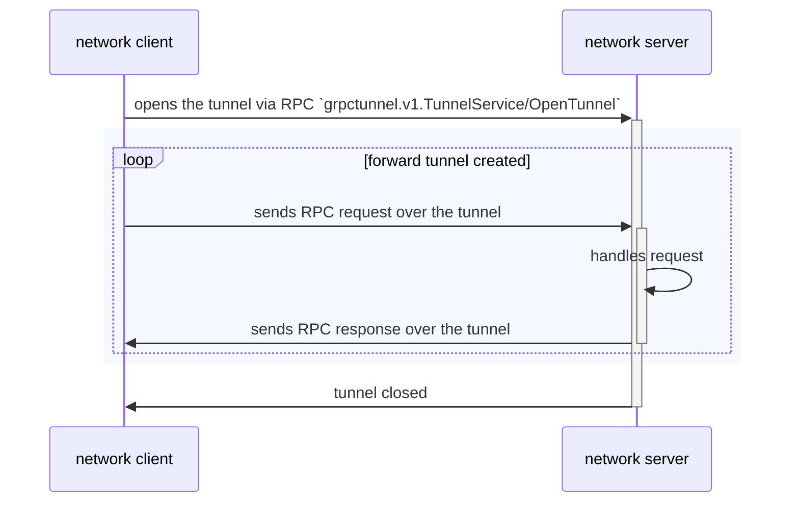
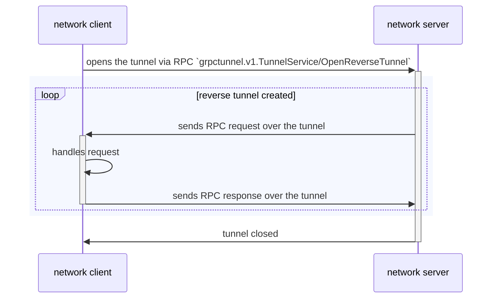

# gRPC Tunnels
[](https://circleci.com/gh/jhump/grpctunnel/tree/main)
[](https://goreportcard.com/report/github.com/jhump/grpctunnel)
[](https://godoc.org/github.com/jhump/grpctunnel)

This library enables carrying gRPC over gRPC. There are a few niche use cases
where this could be useful, but the most widely applicable one is likely for
letting gRPC servers communicate in the reverse direction, sending requests to
connected clients.

The tunnel is itself a gRPC service, which provides bidirectional streaming
methods for forward and reverse tunneling.

 * **Forward Tunnel**: A forward tunnel is the same direction as normal
   gRPC connections. This means that the gRPC client that created the tunnel
   is also the client for requests that flow through the tunnel. For forward
   cases, the server must register service handlers for the gRPC services
   that can be accessed over the tunnel.

   A forward tunnel allows for all requests made on the tunnel to be directed
   to the same server. With a typical gRPC client, connecting to a replicated
   server, requests can round-robin across backends. For typical stateless
   applications, this is desirable for load balancing and robustness. But some
   applications that are not stateless may need affinity. The tunnel provides
   that affinity. Instead of the client making multiple requests, which could
   all be directed to different backends, the client makes one request to open
   a tunnel. The resulting tunnel can then be used to create other RPC stubs,
   so that all requests issued via those stubs are directed to the single
   backend to which the tunnel was opened.

 * **Reverse Tunnel**: A reverse tunnel is the opposite: requests flow in the
   reverse direction of a normal gRPC connection. This means that the gRPC
   client that created the tunnel actually acts as the server. The gRPC server
   with which the reverse tunnel was opened acts as the client, sending requests
   to the gRPC client.

   A reverse tunnel allows for rich "server push"-like capabilities, where a
   server can push data to the client (by initiating an RPC through the reverse
   tunnel) and even get back a response. This kind of functionality can be built
   using regular gRPC bidirectional streams, but this library provides a better
   and more familiar abstraction. A reverse tunnel is also classically used in
   cases where the server cannot be directly dialed due to network topology
   (e.g. being behind NAT). In these cases, the server dials a central router
   and registers itself, allowing the router to forward requests to the server
   over the reverse tunnel.

## Terminology

Talk of tunneling can make concepts like "client" and "server" confusing, since
reverse tunnels swap the typical roles. So in the hopes of clarity, the rest of
this document will use the following terms to hopefully avoid confusion:

* _channel_: A conduit through which gRPC requests can be sent and responses
  received. This can be a TCP connection but can also be a tunnel.
* _tunnel_: A single gRPC stream that can act as a channel, carrying other
  gRPC requests and responses over that stream.
* _tunnel service_: The gRPC service via which a tunnel is opened. This is
  a service named `grpctunnel.v1.TunnelService` and defines the actual
  tunneling protocol, in the form of bidirectional streaming RPCs.
* _tunnel handler_: The implementation of the tunnel service. This is the
  code that handles RPCs to the `grpctunnel.v1.TunnelService` and actually
  implements tunnels.
* _network client_: The gRPC client that opened the tunnel. For typical TCP
  connections, this is the TCP client.
* _network server_: The gRPC server to which a tunnel was opened. For typical
  TCP connections, this is the TCP server.
* _tunnel client_: The gRPC client that initiates requests on a tunnel.
* _tunnel server_: The gRPC server handles requests on a tunnel.
* _forward tunnel_: A tunnel in which the network client is also the tunnel
  client, and the network server is also the tunnel server.
* _reverse tunnel_: A tunnel in which the network server is actually the
  tunnel client, and the network client acts as the tunnel server.

## Tunnel Handler

The tunnel handler is constructed via
[`grpctunnel.NewTunnelServiceHandler`](https://pkg.go.dev/github.com/jhump/grpctunnel#NewTunnelServiceHandler).
The options provided with this call are for configuring reverse tunnel support.
The handler has other methods that can be used to interact with reverse tunnels
that have been established.

The resulting handler has a `Service` method, which returns the actual service
implementation, which can then be registered with a gRPC server using 
[`tunnelpb.RegisterTunnelServiceServer`](https://pkg.go.dev/github.com/jhump/grpctunnel/tunnelpb#RegisterTunnelServiceServer).

```go
handler := grpctunnel.NewTunnelServiceHandler(
    grpctunnel.TunnelServiceHandlerOptions{},
)
svr := grpc.NewServer()
tunnelpb.RegisterTunnelServiceServer(svr, handler.Service())

// TODO: Configure services for forward tunnels.
// TODO: Inject handler into code that will use reverse tunnels.

// Start the gRPC server.
l, err := net.Listen("tcp", "0.0.0.0:7899")
if err != nil {
    log.Fatal(err)
}
if err := svr.Serve(l); err != nil {
    log.Fatal(err)
}
```

## Forward Tunnels

A forward tunnel is one in which the tunnel client is the same as the network
client, and the tunnel server is the same as the network server. So the client
that opened the tunnel is also the one that initiates RPCs through the tunnel.


### Client

The tunnel is opened by the client using the generated stub for the tunneling
protocol: [`tunnelpb.TunnelServiceClient`](https://pkg.go.dev/github.com/jhump/grpctunnel/tunnelpb#TunnelServiceClient).

Once a stream has been established via the stub's `OpenTunnel` method, it can
be used to create a channel via [`grpctunnel.NewChannel`](https://pkg.go.dev/github.com/jhump/grpctunnel#NewChannel).

That channel can be used to create other stubs, as if it were a
`*grpc.ClientConn`. All RPCs issued from stubs created with this channel will be
directed through the tunnel.

```go
// Dial the server.
cc, err := grpc.Dial(
	"127.0.0.1:7899",
	grpc.WithTransportCredentials(insecure.NewCredentials()),
)
if err != nil {
	log.Fatal(err)
}

// Create the tunnel.
tunnelStub := tunnelpb.NewTunnelServiceClient(cc)
stream, err := tunnelStub.OpenTunnel(context.Background())

// Open a tunnel and return a channel.
ch, err := grpctunnel.NewChannel(tunnelStub)
if err != nil {
	log.Fatal(err)
}

// TODO: Create stubs using ch to send RPCs through the tunnel.
```

Client code should not interact with the stream at all or risk corrupting the
tunneling protocol. (All interactions with the stream should be done via the
channel.)

To close the tunnel, use the channel's `Close` method. This will also close the
underlying stream. If any RPCs are in progress on the channel when it is closed,
they will be cancelled. The channel is also closed if the context used to create
the stream is cancelled or times out.

### Server

To handle RPCs that are issued over tunnels, the server must register service
handlers using the `TunnelServiceHandler`.


```go
handler := grpctunnel.NewTunnelServiceHandler(
    grpctunnel.TunnelServiceHandlerOptions{},
)
svr := grpc.NewServer()
tunnelpb.RegisterTunnelServiceServer(svr, handler.Service())

// Register services to be used with forward tunnels.
foopb.RegisterFooServer(handler, &fooServer{})

// To expose a service over both tunnels and non-tunnel connections, you must
// register it with the gRPC server, too.
serviceImpl := newBarServer()
barpb.RegisterBarServer(handler, serviceImpl)
barpb.RegisterBarServer(svr, serviceImpl)
```

## Reverse Tunnels

A reverse tunnel is one in which the tunnel client is actually the network
server; the tunnel server is the network client. So it's the server to which the
tunnel was opened that actually initiates RPCs through the tunnel.


Because the typical roles of client and server are reversed, usage of reverse
tunnels is a bit more complicated than usage of forward tunnels.

### Client

The tunnel is opened by the client using the generated stub for the tunneling
protocol: [`tunnelpb.TunnelServiceClient`](https://pkg.go.dev/github.com/jhump/grpctunnel/tunnelpb#TunnelServiceClient).

However, since the network client will act as the channel server, handlers for
the exposed services must be registered before the tunnel is actually created.
This is done by creating a [`grpctunnel.ReverseTunnelServer`](https://pkg.go.dev/github.com/jhump/grpctunnel#NewReverseTunnelServer)
and then using it to register service implementations, just as one would
register service implementations with a `*grpc.Server`.

Once all services are registered, we can call `Serve` to actually open the
reverse tunnel and accept and process RPC requests sent by the network server.

```go
// Dial the server.
cc, err := grpc.Dial(
	"127.0.0.1:7899",
	grpc.WithTransportCredentials(insecure.NewCredentials()),
)
if err != nil {
	log.Fatal(err)
}

// Register services for reverse tunnels.
tunnelStub := tunnelpb.NewTunnelServiceClient(cc)
channelServer := grpctunnel.NewReverseTunnelServer(tunnelStub)
foopb.RegisterFooServer(channelServer, &fooServer{})
barpb.RegisterBarServer(channelServer, newBarServer())

// Open the reverse tunnel and serve requests.
if _, err := channelServer.Serve(context.Background()); err != nil {
	log.Fatal(err)
}
```

The `Serve` function returns once the tunnel is closed, either via the
tunnel client closing the channel or some other interruption of the
stream (including the context being cancelled or timing out).

### Server

The network server for reverse services is where things get really interesting.
The network server will be acting as a tunnel client. So it needs a way to
inspect the reverse tunnels, to decide which one should be used for an RPC.
It is even possible to group multiple reverse tunnels so they act like a
connection pool, where RPCs can be scattered over multiple tunnels in a
round-robin fashion.

When the handler is created, it is given options that control the behavior of
reverse tunnels:
* `NoReverseTunnels`: Reverse tunnels can be completely disabled this way, which
  will cause all network clients to receive a "Not Implemented" error if they try
  to establish reverse tunnels.
* `OnReverseTunnelOpen`, `OnReverseTunnelClose`: These callbacks, if provided,
  let your application know whenever a reverse tunnel is opened or closed, to
  track the available tunnels. Each such tunnel is a channel that can be used to
  send RPCs to the corresponding network client.
* `AffinityKey`: This is a function for grouping reverse tunnels. The function
  is given a `TunnelChannel` and returns a key. The function has access to the
  corresponding stream's context, from which it can query for properties that
  may be useful for grouping -- such as the authenticated peer, request headers
  provided when the tunnel was opened, and any other context values that may
  have been populated by interceptors. All reverse tunnels with the same key can
  be treated like a connection pool using the handler's
  [`KeyAsChannel`](https://pkg.go.dev/github.com/jhump/grpctunnel#TunnelServiceHandler.KeyAsChannel)
  method.

The callbacks provide the most flexibility for how to make use of the available
reverse tunnels. But the handler has other methods that should be sufficient for
most usages:
* `AsChannel()`: Returns a channel that effectively groups _all_ reverse tunnels
  into a single connection pool. Issuing RPCs with this channel will round-robin
  through them. This works even if no affinity key function was provided when
  then handler was created.
* `KeyAsChannel()`: Similar to above, but allows for selecting a subset of
  reverse tunnels to treat as a single pool. This is only useful if an affinity
  key function is provided when the handler is created.
* `AllReverseTunnels()`: Returns a slice of all available reverse tunnels. This
  allows flexibility for selecting a reverse tunnel, but at a potential
  performance cost since it requires the caller to re-query and re-scan the
  slice prior to issuing an RPC. (Storing the slice and using it for future RPCs
  is risky because the slice is a snapshot that can quickly become stale: new
  reverse tunnels may be opened and items in the slice may be closed.)

All of these channels can be used just like a `*grpc.ClientConn`, for creating
RPC stubs and then issuing RPCs to the corresponding network client.
